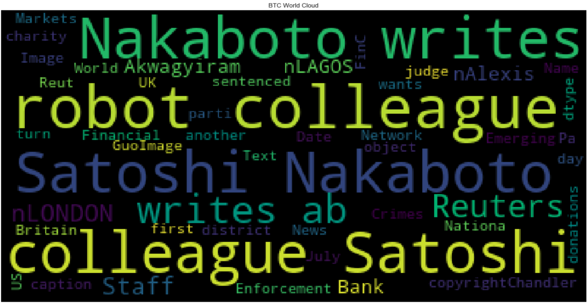

# Natural Language Processing

There's been a lot of hype in the news lately about cryptocurrency, so you want to take stock, so to speak, of the latest news headlines regarding Bitcoin and Ethereum to get a better feel for the current public sentiment around each coin.

Apply natural language processing to understand the sentiment in the latest news articles featuring Bitcoin and Ethereum. Apply fundamental NLP techniques to better understand the other factors involved with the coin prices such as common words and phrases and organizations and entities mentioned in the articles.

Analyze the following:

1. [Sentiment Analysis](#Sentiment-Analysis)
2. [Natural Language Processing](#Natural-Language-Processing)
3. [Named Entity Recognition](#Named-Entity-Recognition)

---

### Files

[Starter Notebook](Starter_Code/crypto_sentiment.ipynb)

---

### Sentiment Analysis

Use the [newsapi](https://newsapi.org/) to pull the latest news articles for Bitcoin and Ethereum and create a DataFrame of sentiment scores for each coin.

#### Questions:

#### Q: Which coin had the highest mean positive score?

* A: ETH had the highest positive mean score at 0.081667 vs. the BTC with 0.069600.

#### Q: Which coin had the highest compound score?

* A: ETH had the "max" highest compound score at 0.912000 vs. the BTC with a "max" of 0.507000. BTH has the highest mean compound score at 0.263190 vs. ETH with 0.191900.

#### Q. Which coin had the highest positive score?

* A: ETH had the highest "max" positive score at 0.27800 vs. the BTC with a "max" of 0.090000. ETH also has a higher mean positive score. 

#### Natural Language Processing

Use NLTK and Python to tokenize the text for each coin. Be sure to:

1. Lowercase each word
2. Remove punctuation
3. Remove stop words

Next, look at the ngrams and word frequency for each coin.

1. Use NLTK to produce the ngrams for N = 2.
2. List the top 10 words for each coin.

Finally, generate word clouds for each coin to summarize the news for each coin.

#### Named Entity Recognition

Build a named entity recognition (NER) model for both coins and visualize the tags using SpaCy.

---

### Resources

[Vader Sentiment Analysis](http://www.nltk.org/howto/sentiment.html)

---
